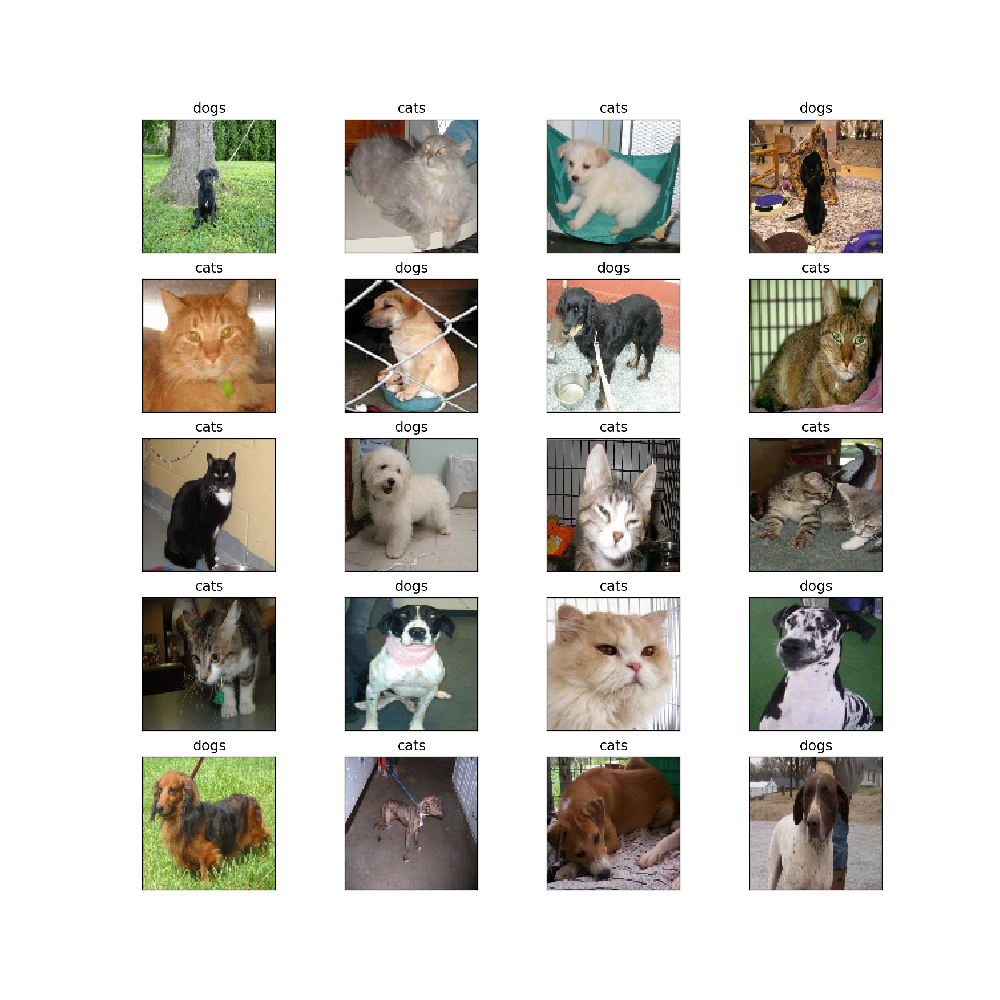

# MachineLearning 

Here you can find useful python templates to generate diverent kind of Machine Learning Models.

### CNN
In the CNN folder you can find a simple Convolutional Neural Network, that generates a model from a "train"-folder.
The "train"-folder should contain multiple folders. Each individual folder should be named after the class. 

You get:
- the model
- an image of random images and their predictions

